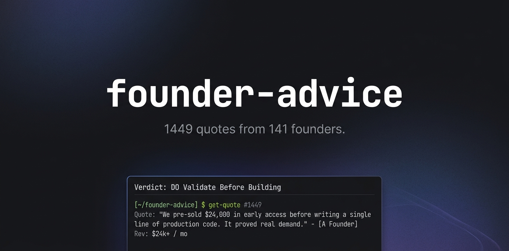

# founder-advice



**Your AI makes up startup advice. This skill doesn't.**

1,449 real quotes from 141 founders with $36.8M/mo in combined revenue. Filtered by your stage. Zero hallucination.

```bash
npx skills add progrmoiz/founder-advice
```

## The Problem

You're building your SaaS in Claude Code or Cursor. You hit a strategy question — "should I do freemium?" or "when should I start marketing?" You ask your AI agent. It gives you a confident answer with zero proof, sourced from training data, not reality.

## The Fix

This skill gives your AI agent access to real founder data. When you ask a strategy question, you get verdicts backed by founders who've actually done it — with their revenue numbers attached.

> "Should I validate before building?"

```
DO: Validate Before Building

97 of 141 founders weighed in: talk to customers and check demand before writing code.

> "Step four is to charge early even if the price is low.
>  We charged during the beta and that really validated
>  that customers were willing to pay."
> — Thomas, Packager ($60K/mo SaaS)

> "I did market research I looked at sensor Tower looked at
>  other apps and I saw that they were crushing it"
> — Steven Creada, Puff Count ($40K/mo mobile app)

DON'T: Overbuild Before Traction

14 founders learned this the hard way:

> "spending months developing random features before launching MVP.
>  Lesson: go to market with something simple, get feedback, then build"
> — Steven Creada, Puff Count ($40K/mo)
```

## Stats

| Metric | Count |
|--------|-------|
| Founder interviews | 141 |
| Advice quotes | 1,449 |
| DO verdicts | 20 |
| DON'T verdicts | 9 |
| Combined monthly revenue | $36.8M |
| Growth channels documented | 437 |
| Pricing decisions documented | 154 |
| Pivot stories | 131 |
| Costly mistakes | 126 |

## Verdict Categories

### DO
- Validate Before Building (97 founders)
- Start Marketing From Day One (99 founders)
- Embrace the Grind (102 founders)
- Keep Product Simple (81 founders)
- Focus on One Channel (66 founders)
- Pick a Painful Niche (63 founders)
- Launch Fast and Ugly (61 founders)
- Charge From Day One (51 founders)
- Outsource Your Weaknesses (27 founders)
- Compete on Speed Not Features (25 founders)
- Iterate Based on Data (21 founders)
- Consistency Beats Talent (20 founders)
- Retention Over Acquisition (20 founders)
- Scratch Your Own Itch (15 founders)
- Plan Your Escape (14 founders)
- Email and Direct Outreach (14 founders)
- Content as Distribution (13 founders)
- Paid Ads After Organic (7 founders)
- SEO Compounds Over Time (6 founders)
- Leverage Tools and AI (6 founders)
- Talk to Customers (4 founders)

### DON'T
- Don't Give Up Too Early (14 founders)
- Don't Overbuild Before Traction (14 founders)
- Don't Target Everyone (10 founders)
- Don't Add Features to Fix Churn (8 founders)
- Don't Spread Across Channels (4 founders)
- Don't Ignore Distribution (3 founders)
- Don't Raise Unless You Must (3 founders)
- Don't Underprice (2 founders)

## Revenue-Stage Filtering

Advice is organized by founder revenue stage. What works at $500/mo is different from what works at $500K/mo. When you tell the skill your stage, it prioritizes founders at a similar level.

## Data Source

All quotes extracted from [Starter Story](https://www.starterstory.com/) YouTube interviews by Pat Walls. Revenue figures are self-reported by founders during interviews (2023-2025). This is survivorship bias data — these founders all succeeded. Use as evidence strategies CAN work, not that they WILL work.

## Credits

- Interview data: [Starter Story](https://youtube.com/@starterstory) by [@PatWalls](https://twitter.com/thepatwalls)
- Inspired by: [@tibo_maker](https://twitter.com/tibo_maker)'s tmaker.io/advisor
- Built by: [@iammoizfarooq](https://twitter.com/iammoizfarooq)
